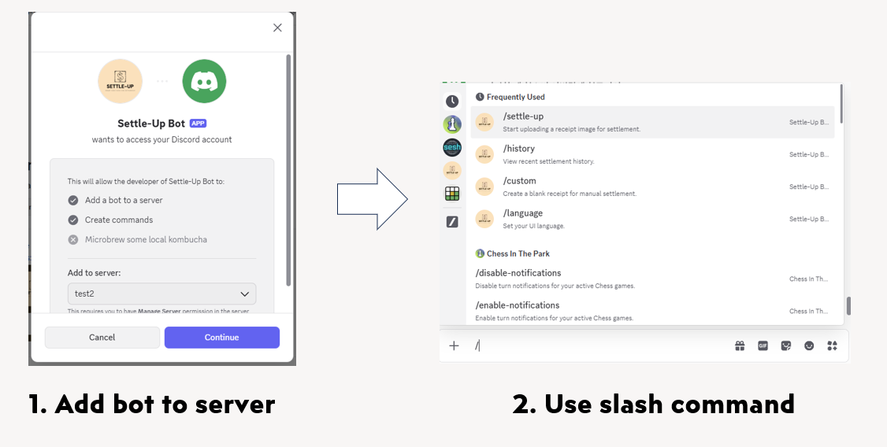
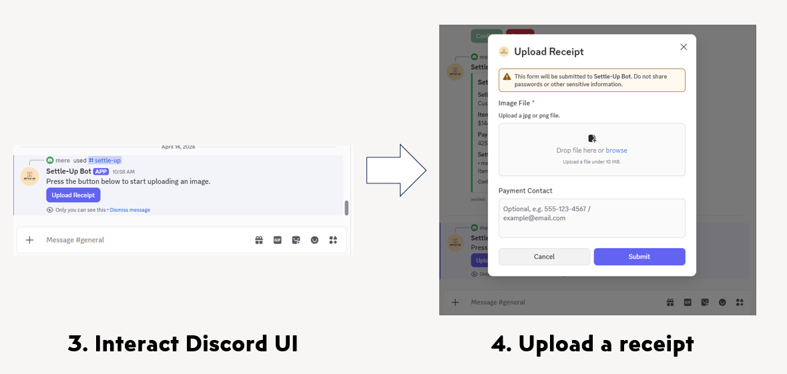
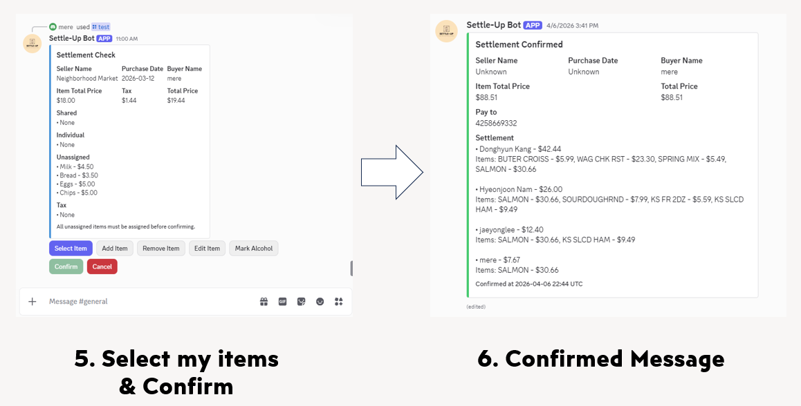

# Settle Up

Settle Up is a cloud-based receipt parsing and expense settlement system integrated with Discord.

Users upload receipt images through a Discord bot, the system extracts structured receipt data with Azure AI services, and participants interact through Discord UI to assign items and confirm settlement results.

This project was built to demonstrate practical distributed-system design in a user-facing product: event-driven receipt ingestion, AI-based document parsing, collaborative Discord UI, and service-to-service coordination across Azure infrastructure.

## Try the Bot

Add the Discord bot here:

- [Invite Settle Up Bot](https://discord.com/oauth2/authorize?client_id=1479660781950734446)

## Project Overview







## Overview

Settle Up is being built as a multi-service mono-repo. The long-term goal is to support receipt upload, OCR-based parsing, collaborative item assignment, and final settlement calculation through a clean service boundary between ingestion, parsing, and downstream settlement workflows.

The project is currently centered on two implemented services:

- `discord-api`: Discord bot interaction, receipt UI, settlement calculation, confirmation flow, and history lookup
- `receipt-parser`: Blob/Event Grid-triggered receipt parsing, draft persistence, and HTTP callback delivery to `discord-api`

## Current Status

The current end-to-end flow has been verified both locally and in Azure for the main receipt workflow:

1. A user uploads a receipt through Discord
2. `discord-api` stores the image in Azure Blob Storage and shows a pending message
3. Blob creation triggers `receipt-parser` through Event Grid
4. `receipt-parser` uses Azure Document Intelligence to parse the receipt
5. The parsed draft is stored in Cosmos DB
6. `receipt-parser` sends the parsed draft to `discord-api` over HTTP
7. `discord-api` renders the public receipt UI in Discord
8. Users assign items and the owner confirms settlement
9. Settlement history is persisted and can be queried later

Additional implemented behavior:

- Public receipt UI is based on updating one main message instead of repeatedly posting new messages
- Routine interactions are debounced and serialized per receipt session
- Tax, tip, alcohol-tax, item-level discount, and KRW tax-included handling are implemented
- `/history`, `/language`, and `/custom` commands are implemented
- Confirmed sessions are cleaned up from in-memory state after completion

## Portfolio Highlights

- Designed a multi-service receipt-settlement system instead of a single monolith, keeping future service separation in mind from the start
- Built an event-driven pipeline across Discord, Azure Blob Storage, Event Grid, Cosmos DB, and HTTP service callbacks
- Implemented collaborative Discord UI flows with session-scoped serialization, debounced updates, and owner-restricted actions
- Integrated Azure Document Intelligence to convert receipt images into normalized structured data for downstream interaction
- Focused on production-oriented concerns such as retry behavior, observability, warm-up paths, and cleanup of stale in-memory state

## AI-Assisted Development Workflow

AI was used as a practical engineering tool throughout this project, with different tools serving different roles.

- Used ChatGPT to explore higher-level architecture, system direction, and design tradeoffs
- Used Codex to help implement code changes, refactors, and documentation drafts in smaller, focused tasks
- Broke larger problems into smaller verifiable units to improve output quality, reduce context drift, and control token usage
- Used AI to accelerate repetitive work such as scaffolding, restructuring, documentation drafting, and iterative cleanup
- Verified generated outputs through manual review, project builds, runtime checks, and follow-up fixes before accepting changes
- Kept final responsibility for correctness, integration, debugging, and technical decisions under direct developer control

This workflow improved iteration speed without giving up engineering ownership or system understanding.

> Note: Many of the documents in this repository were drafted and refined through discussion with Codex, with final wording and project alignment validated against the real codebase.

## Repository Structure

This repository is intended to stay compatible with future service separation.

```text
Settle_Up/
├─ services/
│  ├─ discord-api/
│  └─ receipt-parser/
├─ shared/
│  └─ SettleUp.Observability/
├─ docs/
│  ├─ English/
│  └─ Korean/
└─ Settle_Up.sln
```

Relevant directories:

- `services/discord-api`: Discord bot worker + HTTP receiver service
- `services/receipt-parser`: Receipt parsing web service
- `shared/SettleUp.Observability`: Shared observability/bootstrap project used by current services
- `docs/English`: English project documents, ADRs, and troubleshooting notes
- `docs/Korean`: Korean project documents, ADRs, troubleshooting notes, and `study.md`

## Service Breakdown

### `discord-api`

Responsibilities:

- Runs the Discord bot worker
- Receives user interactions and receipt uploads
- Stores receipt images in Blob Storage
- Exposes HTTP endpoint(s) to receive parsed drafts from `receipt-parser`
- Maintains in-memory receipt session state for interactive check/confirm flow
- Calculates allocations and renders Discord UI
- Persists and serves settlement history

Current implementation notes:

- Public receipt messages are updated in place
- Routine UI refreshes use per-session serialization and a 1-second debounce
- Private selection panels are used for select/add/remove/edit flows
- Owner-only actions currently include add/remove/edit/confirm
- `/language` supports English and Korean
- `/custom` starts a manual settlement flow without parser input

See also: [services/discord-api/README.md](/home/aero-mere/CS397/Settle_Up/services/discord-api/README.md), [services/discord-api/codex.md](/home/aero-mere/CS397/Settle_Up/services/discord-api/codex.md)

### `receipt-parser`

Responsibilities:

- Receives Blob-created events from Event Grid
- Downloads receipt images from Blob Storage
- Calls Azure Document Intelligence `prebuilt-receipt`
- Normalizes parsed output into the current receipt draft contract
- Stores parsed drafts in Cosmos DB
- Sends parsed drafts to `discord-api` over HTTP

Current implementation notes:

- `uploadedByUserId` is extracted from the Blob URL path and is part of the effective downstream contract
- Callback retry is implemented for transient failures
- Parsed document storage and outbound HTTP payload generation are separated
- Startup warm-up reduces first-request cold path for parser dependencies

See also: [services/receipt-parser/codex.md](/home/aero-mere/CS397/Settle_Up/services/receipt-parser/codex.md)

## Runtime Flow

### Receipt Upload to Settlement

1. A Discord user starts the receipt flow in `discord-api`
2. `discord-api` uploads the image to Azure Blob Storage
3. Azure Event Grid sends a Blob-created event to `receipt-parser`
4. `receipt-parser` parses the receipt with Azure Document Intelligence
5. `receipt-parser` upserts the normalized draft into Cosmos DB
6. `receipt-parser` sends the draft to `discord-api` via `POST /getting_draft`
7. `discord-api` creates or updates the receipt session and renders the Discord check UI
8. Participants select items and the owner performs restricted actions if needed
9. On confirm, `discord-api` updates the public message immediately
10. Settlement history is persisted in the background

### Current Integration Choice

The parser-to-bot handoff currently uses HTTP instead of a queue-based downstream transport.

Reasons:

- simpler operational model for the current project stage
- easier debugging during local and Azure testing
- enough for current scale and current workflow complexity

This is a deliberate current-state choice, not a claim that queue-based delivery will never be added later.

## Why This Project Is Interesting

Settle Up is not just a bot command wrapper around OCR. The interesting part of the project is the coordination problem:

- receipt upload starts in Discord, but parsing happens asynchronously in another service
- multiple users can interact with the same receipt UI
- the system has to keep public Discord messages consistent while avoiding noisy updates
- final settlement persistence should happen at the right write boundary, not on every interaction

That pushed the design toward session-aware state management, explicit ownership rules, debounce/serialization strategies, and a service contract between the parser and the Discord-facing application.

## Key Design Choices

### Multi-Service Direction

- The repository is structured as a mono-repo with future services in mind
- Each service should stay independently buildable and deployable
- Shared code is kept explicit under `shared/`

### Concurrency and UI Consistency

- Receipt session mutations are serialized per session
- Routine public-message updates are debounced
- Confirmation is the main write boundary for final settlement persistence
- Discord UI behavior is designed around the fact that button disabled state cannot be personalized per user

### Data Persistence

- `receipt-parser` stores normalized parsed drafts in Cosmos DB
- `discord-api` persists confirmed settlement history
- Raw OCR output is not currently stored in the parser document model

### Reliability

- Transient HTTP and Discord API failures use retry paths where appropriate
- Shared observability and structured logging are used across services
- Startup warm-up is used in both current services to reduce cold-path latency

## Tech Stack

Backend:

- .NET 8
- C#
- ASP.NET Core
- Discord.Net

Azure / Infrastructure:

- Azure Container Apps
- Azure Blob Storage
- Azure Event Grid
- Azure Cosmos DB
- Azure Monitor / Application Insights

AI / Parsing:

- Azure Document Intelligence (`prebuilt-receipt`)

Observability:

- OpenTelemetry
- shared bootstrap under `shared/SettleUp.Observability`
- `ILogger`-based structured application logs

## Demo / User Flow

Typical user-facing flow:

1. Invite the bot to a Discord server
2. Start the receipt flow and upload an image
3. Wait for parsing and draft generation
4. Review the generated receipt UI
5. Let participants assign items
6. Confirm the settlement and view history later

Current implemented commands/features include:

- receipt upload flow through `discord-api`
- parser-driven receipt draft rendering
- item selection, add, remove, and edit flows
- settlement confirmation and history lookup
- language switching between English and Korean
- manual settlement entry via `/custom`

## Local Development

### Prerequisites

- .NET 8 SDK
- Azure account and access to the required Azure resources
- Discord bot token
- Environment-variable configuration for each service

### Important Project Paths

- Discord API project: [services/discord-api/src/DiscordApi.csproj](/home/aero-mere/CS397/Settle_Up/services/discord-api/src/DiscordApi.csproj)
- Receipt parser project: [services/receipt-parser/receipt-parser.csproj](/home/aero-mere/CS397/Settle_Up/services/receipt-parser/receipt-parser.csproj)
- Root solution: [Settle_Up.sln](/home/aero-mere/CS397/Settle_Up/Settle_Up.sln)

### Environment Variables

The exact configuration differs by service.

Commonly relevant values:

- `DISCORD_BOT_TOKEN`
- `ASPNETCORE_ENVIRONMENT`
- `APPLICATIONINSIGHTS_CONNECTION_STRING`

`discord-api` examples:

- `DISCORD_BOT_TOKEN`
- `DISCORD_GUILD_ID`
- `APPLICATIONINSIGHTS_CONNECTION_STRING`

`receipt-parser` examples:

- `ReceiptParser__DocumentIntelligenceEndpoint`
- `ReceiptParser__DocumentIntelligenceApiKey`
- `ReceiptParser__ModelId`
- `ReceiptParser__CosmosConnectionString`
- `ReceiptParser__CosmosAccountEndpoint`
- `ReceiptParser__CosmosDatabaseId`
- `ReceiptParser__CosmosContainerId`
- `ReceiptParser__DiscordApiUrl`
- `ReceiptParser__DiscordApiUrl_local_test`
- `ReceiptParser__EnableLocalUploadTestEndpoint`

For more detail, check the service-specific docs:

- [services/discord-api/AGENTS.md](/home/aero-mere/CS397/Settle_Up/services/discord-api/AGENTS.md)
- [services/receipt-parser/AGENTS.md](/home/aero-mere/CS397/Settle_Up/services/receipt-parser/AGENTS.md)

### Run the Current Services

```bash
dotnet run --project services/discord-api/src/DiscordApi.csproj
dotnet run --project services/receipt-parser/receipt-parser.csproj
```

If shared project references, Docker build contexts, or service project references change, review the matching Dockerfiles and GitHub Actions workflows together.

## Documentation Map

- Root project notes: [codex.md](/home/aero-mere/CS397/Settle_Up/codex.md)
- English docs root: [docs/English](/home/aero-mere/CS397/Settle_Up/docs/English)
- Korean docs root: [docs/Korean](/home/aero-mere/CS397/Settle_Up/docs/Korean)
- Architecture decisions:
  - English: [docs/English/decisions/README.md](/home/aero-mere/CS397/Settle_Up/docs/English/decisions/README.md)
  - Korean: [docs/Korean/decisions/README.md](/home/aero-mere/CS397/Settle_Up/docs/Korean/decisions/README.md)
- Discord API service docs: [services/discord-api/codex.md](/home/aero-mere/CS397/Settle_Up/services/discord-api/codex.md)
- Receipt parser service docs: [services/receipt-parser/codex.md](/home/aero-mere/CS397/Settle_Up/services/receipt-parser/codex.md)
- Recent performance review:
  - English: [performance-review-2026-04-07-post-refactor.md](/home/aero-mere/CS397/Settle_Up/docs/English/problem-searching/performance-review-2026-04-07-post-refactor.md)
  - Korean: [performance-review-2026-04-07-post-refactor.md](/home/aero-mere/CS397/Settle_Up/docs/Korean/problem-searching/performance-review-2026-04-07-post-refactor.md)
- Refactor summary:
  - English: [refactor-summary-2026-04-07.md](/home/aero-mere/CS397/Settle_Up/docs/English/problem-searching/refactor-summary-2026-04-07.md)
  - Korean: [refactor-summary-2026-04-07.md](/home/aero-mere/CS397/Settle_Up/docs/Korean/problem-searching/refactor-summary-2026-04-07.md)

## Near-Term Priorities

- keep Docker and GitHub Actions build contexts aligned with shared projects
- keep the Discord receipt UI stable under real interaction load
- harden parser-to-discord callback validation and failure handling where needed
- preserve clean boundaries for future services
- prefer bug-driven local fixes over speculative large refactors

## Future Directions

Possible future work includes:

- additional settlement-oriented services
- stronger downstream delivery/reprocessing strategies
- broader currency and receipt-format support
- improved operational dashboards and diagnostics
- further hardening based on real production usage
